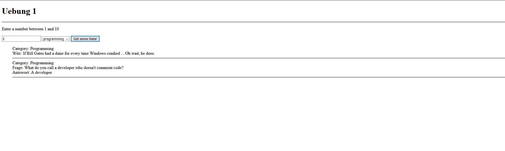

Aufgabe:
Eine Webseite soll Daten von einer API empfangen und diese Daten anschließend ausgegben werden.

1. Baue ein Frontend, womit eine Zahl und eine Category ausgewählt werden kann.
2. Beschäftige dich mit der API und ihren speziellen Rückgaben! Benutze Postman um eine Struktur zu erkennen!
API: https://v2.jokeapi.dev/
3. Schreibe eine fetch, die mit der ausgewählten Category und Anzahl eintritt
4. Gib die Daten aus der Antwort im HTML aus (z.B. ul)
5. Beispielbild: 